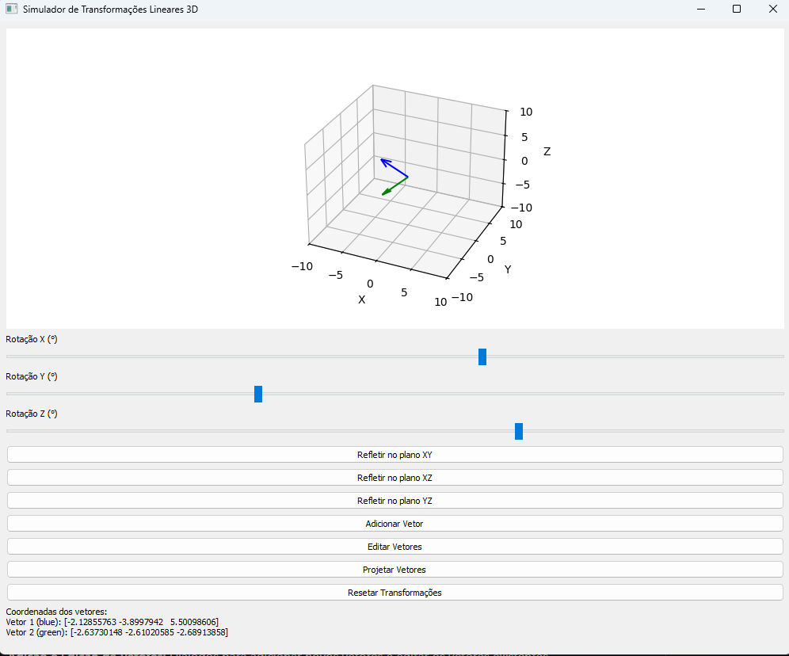

# Simulador de Transformações Lineares 3D



Este é um programa Python que utiliza a biblioteca PyQt5 para criar uma interface gráfica e a biblioteca Matplotlib para visualizar transformações lineares em vetores 3D. Ele permite aos usuários manipular vetores, aplicar rotações, reflexões e projeções, e visualizar os resultados em um gráfico 3D interativo.

## Funcionalidades

* **Visualização 3D:** Plota vetores e suas transformações em um espaço 3D.
* **Controles de Rotação:** Sliders para rotacionar os vetores em torno dos eixos X, Y e Z.
* **Reflexões:** Botões para refletir os vetores nos planos XY, XZ e YZ.
* **Adição e Edição de Vetores:** Diálogos para adicionar novos vetores e editar os vetores existentes.
* **Projeção:** Botão para projetar todos os vetores no primeiro vetor.
* **Reset de Transformações:** Botão para reverter os vetores ao seu estado original.
* **Exibição de Coordenadas:** Mostra as coordenadas dos vetores transformados na interface.

## Pré-requisitos

Antes de executar o programa, você precisa ter o Python 3 instalado, bem como as seguintes bibliotecas:

* **PyQt5:** Para a interface gráfica.
* **Matplotlib:** Para a plotagem 3D.
* **Numpy:** Para operações matemáticas em vetores.

Você pode instalar as bibliotecas usando o pip:

```bash
pip install PyQt5 matplotlib numpy
